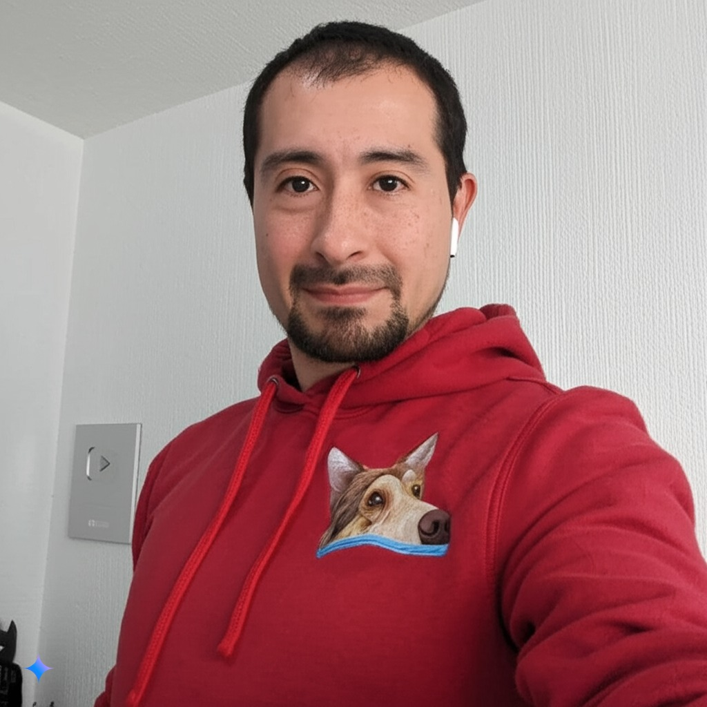

# Integrantes del grupo _3DEV_ de la asignatura Programación en Lenguajes Interpretados

## Profesor

### Jonathan MirCha

Hola soy tu amigo y docente digital... Jonathan Mircha

- [jmiranda@amerike.edu.mx](jmiranda@amerike.edu.mx)
- [_@jonmircha_](https://github.com/jonmircha)
  

---

### Isai Misael Bautista Olvera
Soy un pequeño hombre con gusto por los videojuegos, desarrollador de videojuegos en proceso... 
 - [misagamer@gmail.com](tucorreo@amerike.edu.mx)
 - [Mi perfil de _GitHub_](https://github.com/Misalmon1341)
 

